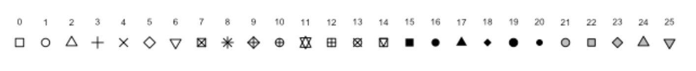

\newpage

# Introduction

This is an [R Markdown](http://rmarkdown.rstudio.com) Notebook. When you execute code within the notebook, the results appear beneath the code.

Try executing this chunk by clicking the *Run* button within the chunk or by placing your cursor inside it and pressing *Cmd+Shift+Enter* (on Mac) or *Ctrl+Shift+Enter* (on Windows).

```{r}
plot(cars)
```
```{r}
library(ggplot2)
data("mtcars")
ggplot(data = mtcars, aes(x = wt, y= mpg)) +
  geom_point(aes(color=as.factor(cyl)), size = 4)
```


Add a new chunk by clicking the *Insert Chunk* button on the toolbar or by pressing *Cmd+Option+I* (on Mac) or *Ctrl+Alt+I* (on Windows).

When you save the notebook, an HTML file containing the code and output will be saved alongside it (click the *Preview* button or press *Cmd+Shift+K* to preview the HTML file).

The preview shows you a rendered HTML copy of the contents of the editor. Consequently, unlike *Knit*, *Preview* does not run any R code chunks. Instead, the output of the chunk when it was last run in the editor is displayed.

You can download and install packages with `install.packages("The name of package")`.

## Markdown:

$$\alpha = \beta = \frac{-\alpha \cdot \gamma^2}{\sqrt{\sigma^3}}$$


\newpage

# Basic of learning

In this part we talk about basic elements of R programming.

## How to Print

```{r}
print('Hello world')
print("This is R programming Workshop!")
```

## Data Types (Classes)

In R, data types (or classes) define the kind of data stored in variables. Here are the most common data types in R:

| **Class**   | **Description**                            | **Example**              | **Code Example**                            |
|:--------------|:--------------------|:--------------|:---------------------|
| `numeric`   | Represents decimal or whole numbers        | 3.14, 42, -7.8           | `x <- 3.14; class(x)`                       |
| `character` | Represents text strings                    | "Hello", "R Programming" | `z <- "Hello"; class(z)`                    |
| `logical`   | Represents Boolean values (TRUE or FALSE)  | TRUE, FALSE              | `is_valid <- TRUE; class(is_valid)`         |
| `complex`   | Represents complex numbers                 | 2+3i, 1-4i               | `c <- 2 + 3i; class(c)`                     |
| `list`      | Represents a collection of different types | A list of numbers, text  | `lst <- list(1, "Hello", TRUE); class(lst)` |

```{r}
print(class(3.14))
print(class('R programming'))
print(class(TRUE))
```

## Arithmetic Operators

| Symbol | Task Performed  |
|:------:|:---------------:|
|   \+   |    Addition     |
|   \-   |   Subtraction   |
|   /    |    division     |
|   \*   | multiplication  |
|  \*\*  | to the power of |
|   \^   | to the power of |
|   %%   |     modulus     |
|  %/%   | floor division  |

```{r}
18 + 4
18 - 4
18 * 4
18 / 4
2 ** 3
2 ^ 3
18 %% 4
18 %/% 4
log(2)
log10(2)
```
```{r}
5 + (4 - 3 * 2)**3 + 1
```

**We can save values in variables:**

```{r}
x <- 18
y = 4
z <- x + y
print(z)
class(z)
```


In R programming, code runs line by line, with only the last assignment determining the final value of a variable.

```{r}
a = 5 + (4 - 3 * 2)**3 + 1
a = 10
a = a * 2
a = a - 5
a
```

### Practice:

Convert a given temperature X degrees Celsius to Fahrenheit. 
$$F= C \cdot \frac{9}{5} + 32 $$

```{r}
temp = 20
fahrenheit <- (temp * 9 / 5) + 32
print(fahrenheit)
```

## Relational Operators

|  Symbol  |      Task Performed      |
|:--------:|:------------------------:|
|   \<-    |        Assignment        |
|    =     |        Assignment        |
| assign() |        Assignment        |
|    ==    |   True, if it is equal   |
|    !=    |  True, if not equal to   |
|    \<    |        less than         |
|    \>    |       greater than       |
|   \<=    |  less than or equal to   |
|   \>=    | greater than or equal to |

```{r}
z <- 10
y = 6
assign('x', 2)

x < y
x >= y
x != y
x == y

x > 2
x >= 2


x > 1 & y < 10
x > 1 & y > 10

x > 1 | y > 10
```

**you can use below command to get special values:**

```{r}
x <- pi
x

e <- exp(1)
e

x <- letters
x

x <- LETTERS
x

x <- month.name
x

x <- month.abb
x
```

**you can write comment with \# :**

```{r}
# This line is comment!
r = 0.2 # interest rate
```

**you can create sequence numbers with below command:**

This work like *arange* in numpy pakage in Python

```{r}
x <- 1:10
x

x <- 1:10 * 2
x

x <- seq(5)
x

x <- seq(from=1, to=9)
x

x <- seq(from=1, to=9, by=3)
x

x <- seq(1,10,2)
x
```

This work like *linspace* in numpy pakage in Python

```{r}
x <- seq(1,10,length = 5)
x
```

Replicate function:

```{r}
x <- 1:3
x

y <- rep(x, time = 5)
y

y <- rep(x, each = 5)
y
```

## Practice:

Simulate GDP growth from the year 2000 to 2025 with an annual growth rate of 3% starting from 1000 units.

$$GDP_{t} = 1000 \cdot (1+r)^{n}$$

```{r}
years = 2000:2025
growth_rate <- 0.03 # rate
GDP = 1000 * (1+growth_rate)**(years - 2000)
GDP
```

## Loops

### if , elif

```{r}
#"R" + 2
```

```{r}
age <- 15
if (age >= 18){
  print('You are old enough to vote!')
} else {
  print('You can NOT vote yet!')
  print(paste('You can will vote after ', 18 - age, ' years.'))
}
```

```{r}
age <- 16
if (age <= 4){
  price = 0
} else if (age < 16){
  price = 50
} else {
#} else if (age >= 16){
  price = 100
}

print(paste("Your cost is $", price))
```


### for loops

```{r}
for (i in 1:5){
  print(i)
}
```
```{r}
for (i in 1:5){
  print(i*i)
}
```
```{r}
z = 0
for (i in 1:10){
  z = z + i
  print(z)
}
```


### while loops

```{r}
i <- 1
while (i < 10){
  print(i)
  i <- i + 1
}
```

### Practice:

Write a conditional statement to check whether the variable is positive, negative, or zero and print the appropriate message.

```{r}
"It's R"
```

```{r}
x <- -5
if (x > 0) {
  print('Positive')
} else if (x < 0){
  print("Negative")
} else {
  print('Zero')
}
```


## function

```{r}
average = function(a,b,c){
  summ = a + b + c
  ave = summ / 3
  return(ave)
}

average(34,12,-23) * 2
```
```{r}
average(23,56,98)
```

```{r}
price_func = function(age){
if (age <= 4){
  price = 0
} else if (age < 16){
  price = 50
} else {
  price = 100
}
print(paste("Your cost is $", price))
}

price_func(18)
```
```{r}
for (i in seq(1:20)){
  #print(i)
  price_func(i)
}
```

### Practice I:

Write a function `temp()` that converts a temperature in Celsius to Fahrenheit.

```{r}
temp <- function(temps){
  fahrenheit <- (temps * 9 / 5) + 32
  print(fahrenheit)
}
temp(90)
```

### Practice II:

Create a function to calculate the **future value** \( K_n \) of an investment after `n` years with a given principal \( K \) and interest rate \( r \).  

The formula for compound interest is:
$$K_n = K \times (1 + r)^n$$
```{r}
future_value <- function(k, r, n){
  k_n <- k * (1+r)^n # future value formula
  return(k_n)
}
future_value(1000, 0.05, 10)
future_value(1000, 0.05, 10) - 1000
```

### Practice III:

Write a function in R that takes a number as input and returns whether the number is even or odd.

```{r}

```

\newpage

# Vetors

The most common way to create vectors is to use function `c()`.

```{r}
x <- c(10.25, 3.5, 8.75, 23.15, 12)
x

x <- c(10.25, 3.5, 8.75, 23.15, 12, 'a', 'b', "c")
x
class(x)

x <- c(1,2,3,4,5,6,7)
x

y <- 1:7
y
```

**Join vectors**

```{r}
x <- c(10,20,30,40)
y <- c(3.5, 4.75)

z <- c(x,y)
z
```

You can find *lenght* of vectors with *lenght()* function:

```{r}
x <- c(1.5, 3.25, 8.75, 13.15)
x

length(x)
```

## Vector Indexing

```{r}
x <- c(10,45,30,50,35,50,80)
x

x[1]
x[3]

x[-2]

x[3:6]

x[c(1,3,4)]

length(x)
x[10]

x
x[2]
x[2] <- -8
x

x[10] = 20
x

x[-3] = 6
x

x
y <- c(TRUE, FALSE, FALSE, TRUE, TRUE, FALSE, TRUE)
y <- c(T, F, F, T, T, F, T)
x[y]
```

Use for loops for access to elemets of vectors

```{r}
for (i in x){
  print(x*2)
}
```

## Matching Operator

```{r}
x <- c(10,45,30,50,35,50,80)
x

35 %in% x
37 %in% x

y <- c(30, 37, 45)
y %in% x
```

## Vector Arithmetic's

```{r}
x <- c(10,45,30,50,35,50,80)
x
x + 2
x * 2
sqrt(x)
```

```{r}
x <- c(10,45,30,50)
y <- c(5,1,2,4)

x + y
z <- c(10,20,30)
x + z
```

## Vector Methods

```{r}
x <- c(10,45,30,50)
x
length(x)

sum(x)
mean(x)

prod(x)

rev(x)

sort(x)

sort(x, decreasing = TRUE)
```


## Logical Vector

```{r}
x <- c(10,45,30,50,35)
x

y <- x > 30 & x < 50
y

x[y]
```

```{r}
x <- c(10,45,30,50,35)
x

which(x>30)
x[which(x>30)]
```

## Factors

-   Used to represent categorical data
-   Treated as integer vector, having a label
-   Factors are self describing

```{r}
x <- c('Male', "Female", "Male", 'Male', "Female")
x

x <- factor(x)
x

table(x)

```

## Mathematical Function in R

```{r}
x <- c(4.325, -3.453, 5.324, 7.844)
x

ceiling(x)  # next integer

floor(x)

round(x)

round(x, digits = 2)

```

```{r}
x <- c(16,25,30,81,36)

sqrt(x)

log(x)

log(x, base = 2)

log10(x)

x <- c(3,4,5,6)
factorial(x)
```

## Random Number in R

```{r}
x <- rnorm(10)
x

x <- rnorm(10000, mean = 0, sd=1)
#x

mean(x)
sd(x)


```

## Practice:

Given a list of students `("Alice", "Bob", "Charlie", "David", "Eve")` and their corresponding scores `(85, 92, 78, 55, 88)`, extract the names and scores of students who passed (`score >= 60`). Also, calculate the mean score of the students who passed.

```{r}
students <- c("Alice", "Bob", "Charlie", "David", "Eve")
scores <- c(85, 92, 78, 55, 88)
```

\newpage

# Matrix

## Creat Matrix

Matrix are 2-dimensional vectors and dimensional attribute is of length 2 (rows and columns). We should to know that Matrix contain elements of same type.

```{r}
m <- matrix(nrow = 2, ncol = 3)
m

dim(m)
```

```{r}
m <- matrix(c(1,2,3,4,5,6))

m <- matrix(c(1,2,3,4,5,6), nrow = 2, ncol = 3)

m <- matrix(c(1,2,3,4,5,6), nrow = 2, ncol = 3, byrow = TRUE)

m

dim(m)
nrow(m)
ncol(m)
length(m)
```

## Matrix diag

like `numpy.full` in python

```{r}
m <- matrix(0, 3,3)
m
```

like `numpy.diag` in python

```{r}
m <- diag(1, 3,3)

m <- diag(4)

m <- diag(1:5)
m
```

for find the elements of diagonal of matrix:

```{r}
m <- matrix(seq(1, 31, by=2), nrow = 4, ncol = 4, byrow = T)
m

diag(m)
```


## Matrix Indexing

Indexing in R programming is similar to Python.

```{r}
m <- matrix(seq(1, 31, by=2), nrow = 4, ncol = 4, byrow = T)
m
```
```{r}
m[1, 2]
m[1,]    # for get single row
m[,2]
m[,1:2]
m[2:3,1:2]
m[,c(1,3)]
m[,-2]
```


You can change values in matrix.

```{r}
m

m[2,1] = 23
m
```

## Matrix Specific Functions

```{r}
m
```
```{r}
rowSums(m)
colSums(m)
rowMeans(m)
colMeans(m)
t(m)

colSums(m)[3]
```


## Practice I
Create a 4x4 matrix of random integers between 1 and 100.

- Print the matrix.
- Calculate the row-wise sum and column-wise mean.
- Check if the matrix is symmetric by comparing it to its transpose.

```{r}
set.seed(123)
mat <- matrix(sample(1:100, 16), nrow = 4)
mat

rowMeans(mat)
colMeans(mat)

mat

t(mat)

all(mat == t(mat))
```

## Practice II
Given a 3x3 matrix A of integers and a vector b = (30, 20, 15), solve the linear equation $A \cdot X=b$.
```{r}
set.seed(123)
A <- matrix(sample(1:10, 9, replace = TRUE), nrow = 3)
b <- c(30, 20, 15)

A
b

x <- solve(A, b)   # solve for x
x


Ax = A %*% x
Ax
```


\newpage

# Lists

## Creat list

`Lists` are also collecting of data and another kind of data storage. Lists can contain elemnts of any type of R object and these elements of list don't need be same type. You can creat list by using `list()` function.

```{r}
x <- list(10, 'Saeed', TRUE)
x
```

Create list with vectors

```{r}
class
```

## List subset Operator

```{r}
id <- c(101,102,103, 104, 105)
names <- c("Sanaz", "Saeed", "James", "Peter", "Emma")
scores <- c(98.45, 45.65, 78.79, 56.32, 87.23)

students <- list(id, names, scores)
students
```

```{r}
students[2]

students[[2]][1]
```

\newpage
# Dataframe

Dataframes are objects in R and used to store tabular data. Unlike a matrix in data frame each column can contain different modes of data. The first column can be numeric while the second column can be character and third column can be logical. It is a list of vectors of equal length. Dataframe can be created using `data.frame()` function or imported from various file types. 

  - `read.table()``
  - `read.csv()``

## Creating Dataframes

```{r}
id <- c(101,102,103, 104, 105)
names <- c("Sanaz", "Saeed", "James", "Peter", "Emma")
scores <- c(98.45, 45.65, 78.79, 56.32, 87.23)
students <- data.frame(id, names, scores)
students
```

## Dataframes Indexing

```{r}
students
```
```{r}
students[1,]
students[,2]

# Same as Matrix

students$names
students$scores
students$names[2]
```


## Dataframes `subset()` function for filtering

```{r}
students
```
```{r}
report <- subset(students, scores < 80)
report

report <- subset(students, scores < 80 & id <=103)
report

report <- subset(students, scores < 80, select = c(names))
report

report <- subset(students, scores < 80, select = c(names, scores))
report

report <- subset(students, scores < 80, select = c(-names))
report
```


## Dataframes `rbine()` and `cbind()`

```{r}
students
```

```{r}
students <- rbind(students, data.frame(id= 106, names= 'Sara', scores = 68.57))
students
```


add rows


add columns

```{r}
students = cbind(students, age = c(18,24,19,26,34,23))
students
```

## Saving data in csv

```{r}
students

write.csv(students, file = "scoring.csv")
```


## Missing Data

In this part we find out how handle a missing data like `NA`.

This function is like `.isnull()` in python programming.

```{r}
x <- c(10,4,NA,7,15,NaN)
x

is.na(x)
is.nan(x)
```

Remove missing values

```{r}
x <- c(10,4,NA,7,15,NaN)
x

y <- is.na(x)
y

!y

x[!y]
```

```{r}
weather <- data.frame(
  id = c(101, 102, 103, 104, 105),
  temperature = c(25.8, 34.2, NA, 27.4, 20.5),
  wind = c(78, 59, 63, 40, 68),
  humidity = c(25, 45, 85, NA, 61)
)
weather
```

```{r}
weatherNA <- complete.cases(weather)
weatherNA

weather[weatherNA,]
```


\newpage
# Dplyr Package

You can download and install packages with install.packages("The name of package"). In this case, run `install.packages('dplyr')` to download and install `dplyr` package.

Also, you can import packages in R with `library()` function.

```{r}
library(dplyr)
```

Data is imported in to dataframes using: `read.csv()`

`read.csv()` arguments:

  - **file:** name of the file (mandatory argument)
  - **header:** logical value (default is false)
  - **sep:** separator (default is comma (`,`))
  

```{r}
df <- read.csv("murders.csv")
df
```
you can see head or tail of data with below function. It's work like `.head()` and `.tail()` in Pandas package in python.

```{r}
head(df, 5)

tail(df, 5)
```

like `.shape` in pandas package in python

```{r}
dim(df)
```
like `.describe()` in pandas package in python for understand structure of data:
```{r}
str(df)
```

## dplyr `select()` function

**Select special columns**

Select with number of columns:
```{r}
df[c(2,4,5)]
```

Select with name of columns:
```{r}
df[c('state', 'population', "murders")]

dfprime = select(df, 'state', "region", 'murders', 'population')
dfprime
```
for get names of columns, you can use below function. This work like `.columns` in pandas package in Python.

```{r}
names(df)

#names(df)[3:5]
```

Also you can select range of columns:

```{r}
dfprime <- select(df, state:population)
dfprime
```

You can drop columns with use minus sign (`-`) in `select` function.

```{r}
dfprime <- select(df, -abb)
dfprime

dfprime <- select(df, - c(abb, murders, gunmurders))
dfprime

dfprime = select(df, -(abb:murders))
dfprime
```

## dplyr `filter()` function

```{r}
head(df)
```
```{r}
#names(df)

dfprime <- filter(df, murders > 500)
dfprime
```
```{r}
dfprime <- filter(df, murders > 500 & population > 10^7)
dfprime
```

```{r}
df$population

mean(df$population)

dfprime <- filter(df, population > mean(df$population))
dfprime
```


  ## dplyr `arrange()` function
```{r}
head(df)
```

```{r}
dfprime <- arrange(df, murders)
dfprime

dfprime <- arrange(df, desc(murders))
dfprime
```


## dplyr `rename()` function

```{r}
names(df)
```

```{r}
df2 <- rename(df, abbreviation = abb)
names(df2)
```

```{r}
df2 <- rename(df, abbreviation = abb, homicide = murders)
names(df2)
```


## dplyr `mutate()` function

```{r}
dfprime <- mutate(df, ratio = murders / population)
head(dfprime)
```

### Practice:
Import the data and Create a new column called murder_rate that shows the murder rate (murders per million people)

```{r}
dfprime <- mutate(df, mpopulation = population / 10^6)
dfprime <- mutate(dfprime, murder_rate_m = murders / mpopulation)
dfprime
```


  
## dplyr `group_by()` function

```{r}
names(df)
```
```{r}
dfprime <- group_by(df, region)
dfprime
```

```{r}
summarise(dfprime, sum(murders))

summarise(dfprime, sum(murders), mean(gunownership), median(population))

```

## dplyr Pipe Operator %>%

```{r}
names(df)
```
```{r}
dfprime <- arrange(df, murders)
dfprime

dfprime2 <- select(dfprime, state, murders)
dfprime2

head(dfprime2)
```
```{r}
arrange(df, murders) %>% select(state, murders) %>% head()
```

```{r}
# Practice -1
df %>% mutate(murder_rate = (murders / population) * 10^6) %>% arrange(desc(murder_rate)) %>% head(10)
```


### Practice:
Find the states with a population greater than 10 million and murders greater than 500. Display only the state, population, and murder columns.

```{r}
df %>% filter(population > 10^7 & murders > 500) %>% select(state, population, murders) %>% arrange(murders)
```

\newpage
# Data Visualization with `dplyr`

## Bar Graphs

```{r}
head(df)
```

```{r}
barplot(df$population, 
        col = 'blue', 
        xlab = 'State',
        ylab = 'Population',
        main = 'State VS Population',
        names.arg = df$state
        )
```
```{r}
dfprime <- arrange(df, desc(murders)) %>% head(5)
#dfprime
barplot(dfprime$murders,
        col = 'red', 
        xlab = 'State',
        ylab = 'Population',
        main = 'State VS Population',
        )
```


**Horizontsl Bar Graphs**

```{r}
dfprime <- arrange(df, desc(murders)) %>% head(5)
#dfprime
barplot(dfprime$murders,
        col = 'green', 
        xlab = 'State',
        ylab = 'Population',
        main = 'State VS Population',
        horiz = TRUE
        )
```


## Scatter Plots

The default of `plot` functions is Scatter plot.

```{r}
head(df)
```

```{r}
plot(df$population / 10^6, df$murders,
        col = 'red', 
        xlab = 'Population',
        ylab = 'Murders',
        main = 'Murders VS Population',
        pch = 19
     )
```


**pch values**

Values of pch are stored internally as integers.




## Line Graphs

```{r}
plot(df$murders,
     type = "o",
     xlab = 'state',
     ylab = 'murders',
     main = 'States vs murders',
     col = "blue"
     )
```

**`type` in `plot` function**

 - **"p"** for points,
 - **"l"** for lines,
 - **"b"** for both points and lines,
 - **"c"** for empty points joined by lines, 
 - **"o"** for overplotted points and lines,
 - **"s"** and **"S"** for stair steps,
 - **"h"** for histogram-like vertical lines,
 - **"n"** does not produce any points or lines.


## Box plots
```{r}
boxplot(df$murders ~ df$region,
        col = 'red',
        border = 'blue'
        )
```

## Multiple Plots in Layout

```{r}

par(mfrow = c(1,2))

barplot(df$population, col = 'blue')

barplot(df$murders, col= 'red')

# add 4 plot
```

\newpage
# Regressions and Models

## Simple Linear Regression
Linear regression is used to model the relationship between a dependent variable and one or more independent variables by fitting a line through the data.

```{r}
df
```

```{r}
model <- lm(murders ~ population, data = df)
summary(model)
```


## Multiple linear regression
Multiple regression extends linear regression by adding more independent variables to better predict the dependent variable.

```{r}
names(df)
```


```{r}
model <- lm(murders ~ population + gunownership, data = df)
summary(model)
```

#### Practice:
Add `region` (as a categorical variable) to the multiple regression model.

```{r}
# as.factor(region)
model <- lm(murders ~ population + gunownership + as.factor(region), data = df)
summary(model)
```


### t-test (Comparing Means)
A t-test compares the means of two groups to determine if they are statistically different.


```{r}
region1 <- df[df$region=='Northeast','murders']
region2 <- df[df$region=='South','murders']

t.test(region1, region2)
```


### Correlation Test
A correlation test checks the strength and direction of the relationship between two variables.

```{r}
cor.test(df$population, df$murders)
```

#### Practice

```{r}
# core gunownership and murders
```

### ANOVA (Analysis of Variance)
 ANOVA tests if there are significant differences between the means of three or more groups.
 
```{r}
anova = aov(murders ~ region, data = df)
summary(anova)
```
 
###  Regression Plots
```{r}
plot(df$population, df$murders, col= 'blue', pch=19)
model <- lm(murders ~ population + gunownership, data = df)
summary(model)

abline(model, col='red', lwd=2)
```


